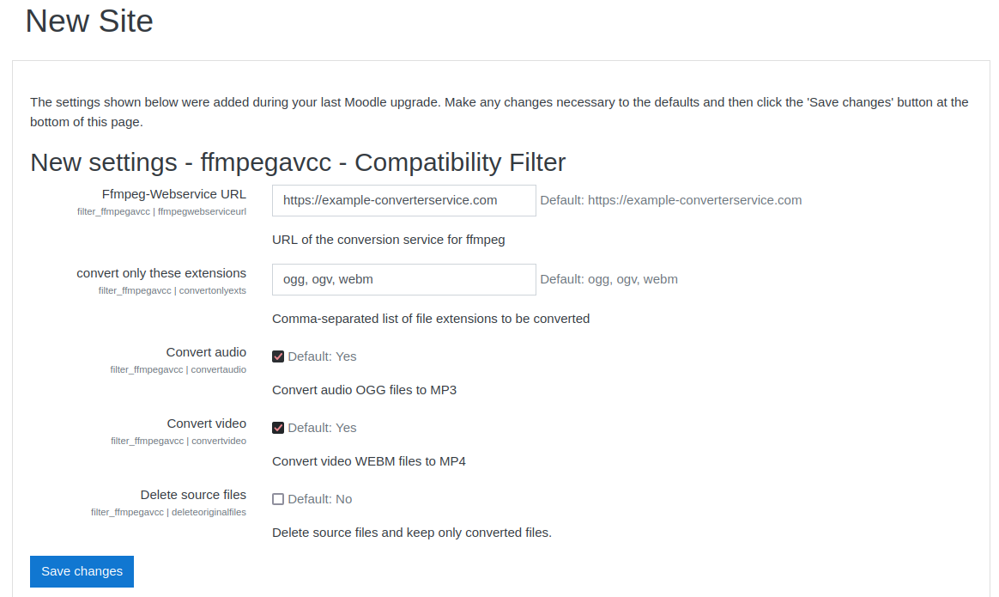

# Moodle ffmpeg based HTML5 audio/video to MP4 filter

This Plugin is based on the HTML5 audio/video to MP4 filter from [Nicolas Dunand](https://github.com/ndunand/moodle-filter_html5avtomp4) and changes its implementation in a way that all ffmpeg conversions are executed by a webservice. This allows users to profit from the functionality provided by the filter without the need to have `ffmpeg` installed on your Moodle Server.

## About

> This filter allows the automated creation of MP4 sources for HTML5 `<audio>` and `<video>` elements.
>
> This is particularly useful if some users are using [atto_recordrtc](https://docs.moodle.org/37/en/RecordRTC) because most browsers create `.ogg` files for audio and `.webm` files for video, which are not playable in Safari.
>
> This plugin then checks for the existence of an `mp4` source in the same file area and provides it automatically if it exists. In the case the `mp4` source does not exist, it is created via a scheduled task.

This filter extends the original functionality in a way that `audio` elements are converted to a compatible audio format (`mp3`) whereas `video` elements are converted to `mp4`.

## Requirements

A running [`ffmpeg-conversion-webservice`](https://github.com/team-parallax/dynamic-conversion-service/) and its url to be set in plugin settings.

## Installation

> [!NOTE]
> Make sure that the [conversion webservice](https://github.com/team-parallax/dynamic-conversion-service/blob/main/README.md) is running before trying to use the ffmpegavcc-filter

1. Create a `.zip` archive of the ffmpegavcc-filter. For example via the CLI in the project root directory with:
    ```bash
    zip -r ffmpegavcc.zip -x '.*' '*test*' -u .
    ```
2. Make sure your moodle instance and moodle database is running
3. With an admin account log into moodle and head to `Dashboard / Site administration / Plugins / Install plugins`
4. Under `Install plugin from ZIP file` select `Choose a file...` and choose the `ffmpegavcc.zip` that was created in step 1
5. Click the `Install plugin from the ZIP file` button and click `Continue`/`Upgrade Moodle database now` until you reach the settings page
6. Adapt the plugin settings to your liking **Make sure at least `Ffmpeg-Webservice URL` is set**
   
   (use `http://172.17.0.1:3000` if you run a local docker image of the conversion service)
   Optionally you can:
    - specify the file-extensions that should be converted by the filter
    - choose whether to convert audio or video files
    - delete the source file after a file was converted
    - tweak the execution times of the scheduled task running the file conversions
7. Head to `Dashboard / Site administration / Plugins / Filters / Manage filters`
8. Activate the `ffmpegavcc - Compatibility Filter` and move it to the top via the arrow buttons
9. Optionally: Head to the `Settings` of the `ffmpegavcc - Compatibility Filter` and click `Test Connection to Ffmpeg-Webservice` to make sure that the connection to the webservice is working as intended
   [Hint: Here you may also change the settings you made in the installation step earlier]

## Usage

0. have a conversion service at your hand: `https://github.com/team-parallax/dynamic-conversion-service/`
1. enable crons here: `http://localhost:8080/admin/settings.php?section=sitepolicies` and set `Cron execution via command line only` to `false`.
2. create a new post with videos/audios in it (see our example files)
3. then we curl it like so `curl 'http://localhost:8080/admin/cron.php?password=opensesame'` (if the password you've set is `opensesame`)
4. wait until conversion is finished
5. observe the added source of the audio/video html tag

## Contributing

### Moodle test instance

Running `docker compose up` in the `test` folder of the project will start a Moodle instance and its database.
When running this for the first time the instance will be initialized with a default moodle configuration.

> [!WARNING]
> This moodle setup is not feasible for production environments!

### Running webservice tests

These tests are intended to check if the communication functionality of the plugin works and handles the webservice responses correctly.

To run the test-script issue the command:
(_Omitting the tag will result in pulling the 'latest' php image_)

```bash
docker run --rm --net=host -it -v $PWD:/app php:<YOUR TAG> php /app/test.php
```
